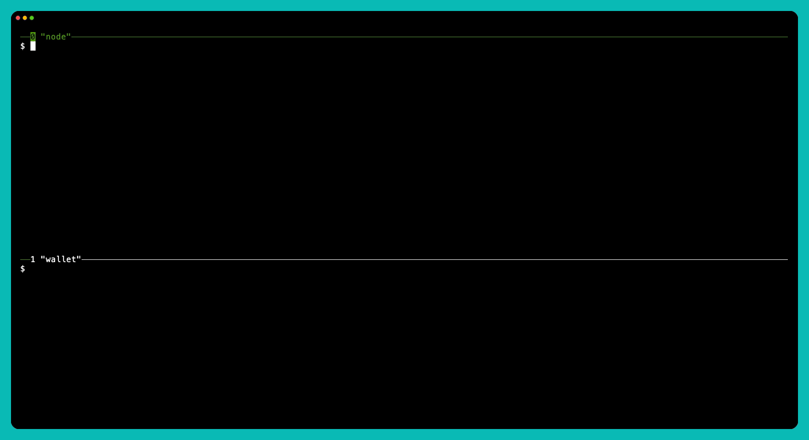

# StryiChain

StryiChain is a Rust blockchain prototype built for experiments and learning.

It combines a CPU-oriented Proof-of-Work based on Tor's `HashX` and
`BLAKE3`, `libp2p` networking, `gRPC` sync, and a CLI wallet for local
testing.

The project is named after the [Stryi River](https://en.wikipedia.org/wiki/Stryi_(river)) in Ukraine.

## Quickstart

Generate a 20-block demo chain, start a local node, inspect `nodestate`, send a transaction, and watch chain lenght
grow.



## Crates

- `stryi_core`: core blockchain logic and shared domain types (`Block`, `Transaction`, `AccountAddress`, and more) + tx mempool implementation
- `stryi_node`: the node binary, grpc and http servers, config engine, miner, main event loop,
- `stryi_storage`: storage layer for blocks, UTXOs, transactions. Powered by the [fjall](https://crates.io/crates/fjall) db
- `stryi_network`: p2p networking and higher-level protocol glue
- `stryi_devkit`: local development utilities, currently - just a powerful chain generator CLI tool
- `stryi_wallet`: the CLI wallet

## Build

Install some dependencies:

```bash
# Ubuntu
sudo apt-get install -y --no-install-recommends \
  clang \
  libprotobuf-dev \
  libssl-dev \
  pkg-config \
  protobuf-compiler
  
# MacOS :
brew install protobuf openssl pkg-config
```

On other platforms make sure you have the required dependencies installed.

Build the binaries used in the local demo:

```bash
cargo build --release -p stryi_devkit -p stryi_node -p stryi_wallet
```

## Local Demo

This walkthrough creates a disposable chain in `/tmp/stryi-demo`, starts a
local node, and sends a transaction between two demo accounts.

Demo assets live in [`demo/`](demo). The labeled keys used below are
recorded in [`demo/genesis-keys.txt`](demo/genesis-keys.txt).

All commands below run from the repository root:

### 1. Generate the chain and start the node

```bash
# generate a 20-block chain into /tmp/stryi-demo/chain
rm -rf /tmp/stryi-demo && ./target/release/stryi-devkit chaingen --config-path demo/chaingen.toml

# start the node, serving HTTP on http://localhost:5556
./target/release/stryi-node --config-path demo/node.toml --genesis-config-path demo/genesis.json
```

Leave the node running. Open a second terminal in the repository root before continuing.

### 2. Explore the chain and import the demo accounts

```bash
# inspect the generated chain
./target/release/stryi-wallet nodestate
./target/release/stryi-wallet block 20

# import the demo accounts
./target/release/stryi-wallet --wallet-path /tmp/stryi-demo/wallet.json import --key 3a7dc55eecb56b8f36874f6920e56a4c4c103ea82b5a168d073d2b49394f3499 --label alice
./target/release/stryi-wallet --wallet-path /tmp/stryi-demo/wallet.json import --key 9a95bf6f928f55be8e757917cdc20a3a12d4e2fcfd5b01243d6db6db7005b019 --label bob

# verify wallet contents and balances
./target/release/stryi-wallet --wallet-path /tmp/stryi-demo/wallet.json list

# no --wallet-path needed; querying addresses directly
./target/release/stryi-wallet balance @4c8c01f08adc9162ff3d137389399634a375d6d6 @3972d0819c496cadff43cc37f99a9322745aa397
```

### 3. Send a transaction

```bash
# send from alice to bob and wait for confirmation
./target/release/stryi-wallet --wallet-path /tmp/stryi-demo/wallet.json send --from @4c8c01f08adc9162ff3d137389399634a375d6d6 --to @3972d0819c496cadff43cc37f99a9322745aa397 --amount 25000 --wait
```

## Wallet Interactive Mode

If you want to use the wallet as a REPL instead of one-shot commands, start
it after the node from step 1 is already running.

```bash
./target/release/stryi-wallet --wallet-path /tmp/stryi-demo/wallet.json -i
```

This is the session shown in the GIF below. The wallet connects to the node
at `http://localhost:5556` by default. It does not start the node itself.


## What is NOT (yet?) implemented

- Bitcoin-style transaction scripts. Scripting support for things like coin locking and other non-trivial
  spending conditions
- A more capable wallet implementation that can create transactions with multiple outputs.
- Multisig (or threshold signatures) support
- An ENS-like username system, but native and baked into the core architecture
    - The idea: social-networks-inspired username format like @trinity, @neo, @007 as first-class AccountAddress values
    - Would probably need new `TransactionKind` variants to handle renting, buying, and transferring names
    - Probably needs a decentralized storage layer for name resolution (via Kademlia DHT?)
- A minimalistic block explorer (something like etherscan) using htmx and ssr
- stryi_devkit's loadgen tool

## Testing

### Unit Tests

Install `cargo-nextest` if needed:

```bash
cargo install cargo-nextest --locked
```

Run the test suite:

```bash
cargo nextest run --workspace
```

### Integration Testing

See the [Local Usage section](e2e/README.md#local-usage) in the E2E README.

### CI

Two manual GitHub Actions workflows to test different layers:

- `Run nextest`
  Runs `cargo nextest run --workspace` for fast and parallel unit test runs.
- `E2E`
  Runs multi-container system scenarios. The available scenarios are described in [e2e/README.md](e2e/README.md).
  The `reorg` E2E scenario also publishes benchmark artifacts and a Bencher report.


# Usefull Links
- HashX:
  - https://tpo.pages.torproject.net/core/doc/tor/md_ext_2equix_2hashx_2README.html
  - https://gitlab.torproject.org/tpo/core/arti/-/issues/889

- Others:
  https://btcinformation.org/en/developer-reference
